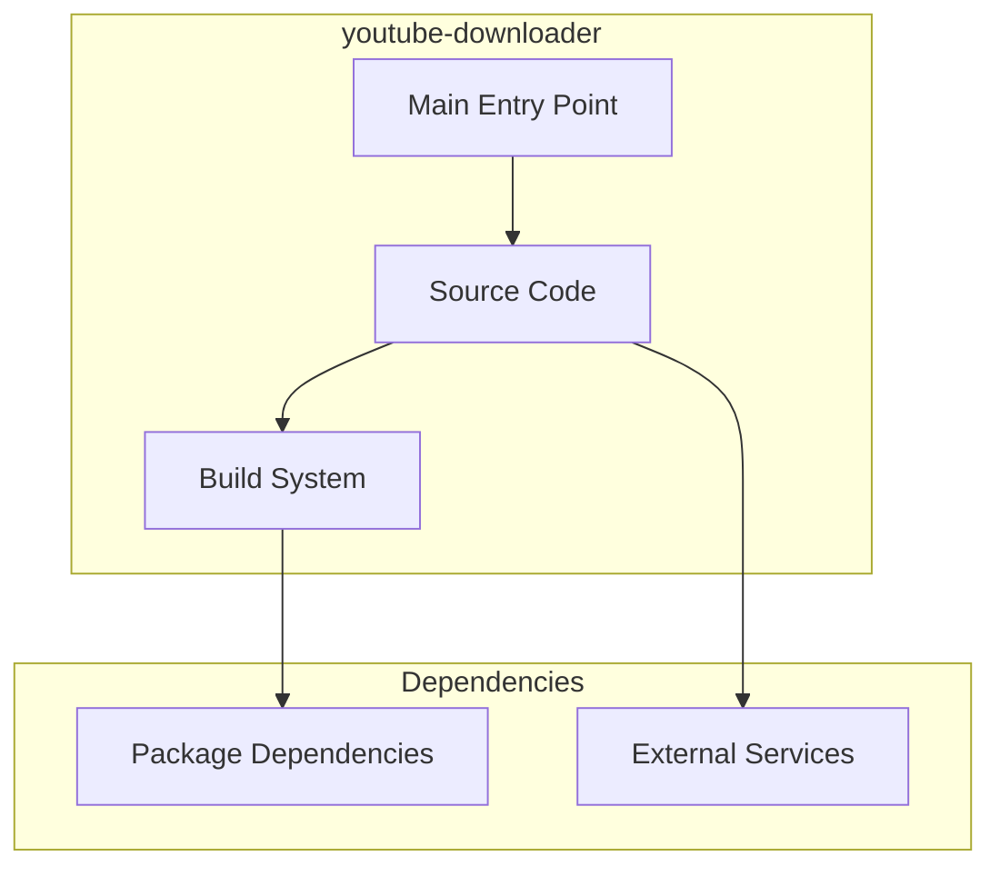

# youtube-downloader Architecture

**Generated:** 2026-07-28  
**Project Type:** Python (Scripts)  
**Architecture Pattern:** YouTube download utility scripts

## Overview

YouTube video downloader scripts supporting single videos and playlists with format selection.

## Technology Stack

Python 3, pytube/yt-dlp

## Source Layout

Root-level .py files

## Architecture Diagram

## Key Patterns

- **YouTube download utility scripts**
- Version control: Shared monorepo git

## Cross-Cutting Concerns

- **Linting/Formatting:** Aligned with workspace root configs (ESLint, Prettier, Ruff)
- **Documentation:** AGENTS.md + standard doc files per project convention
- **Dependencies:** Managed via project-specific package manager

## Related Documents

- [Folder Structure](./youtube-downloader_folders.md)
- [Technology Stack](./youtube-downloader_techstack.md)
