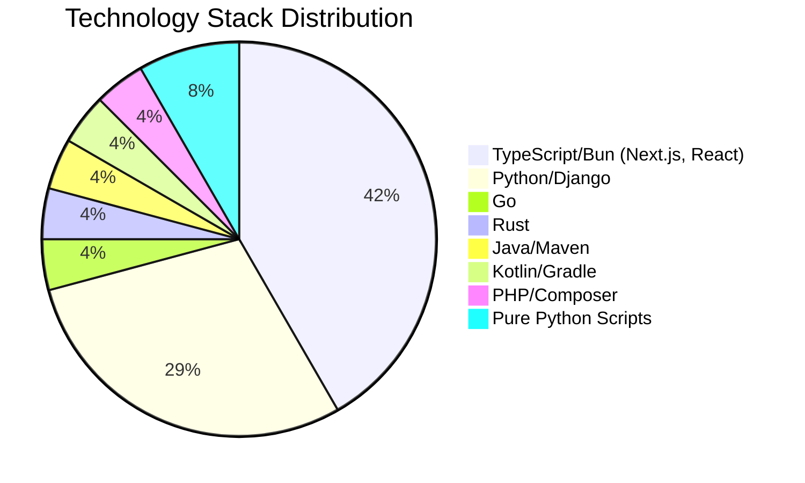
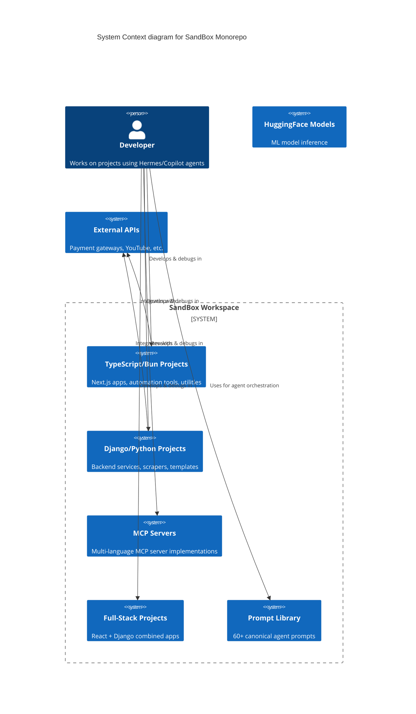
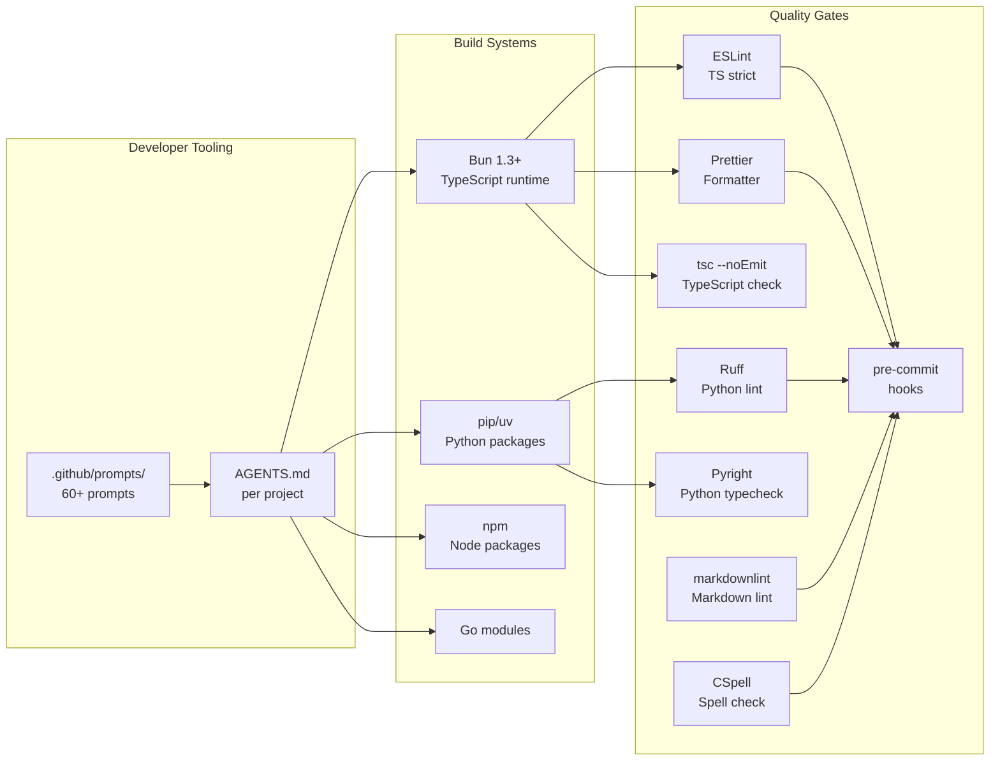
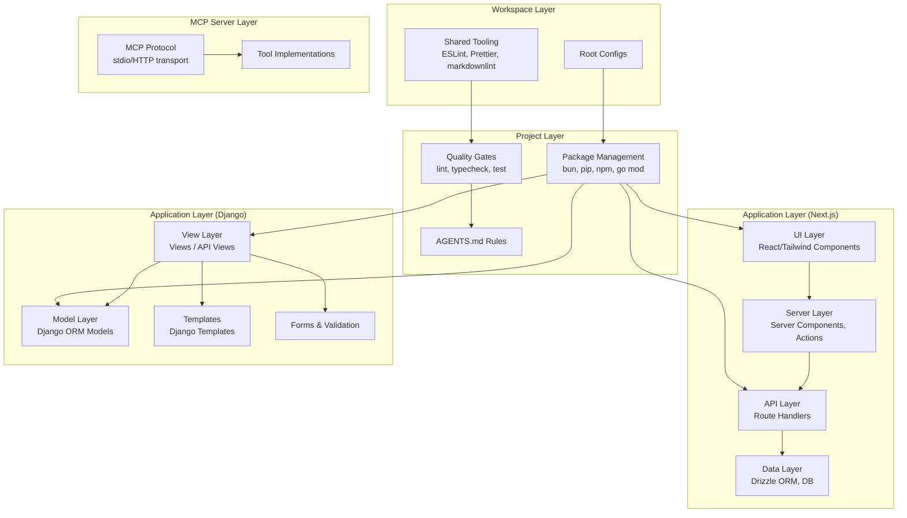
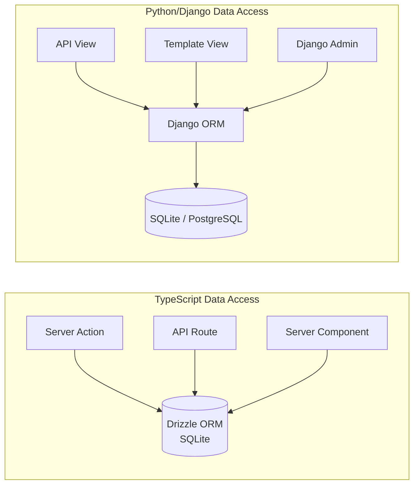
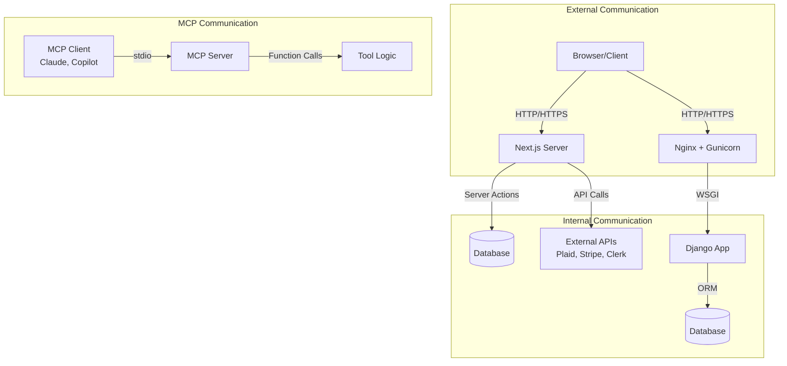
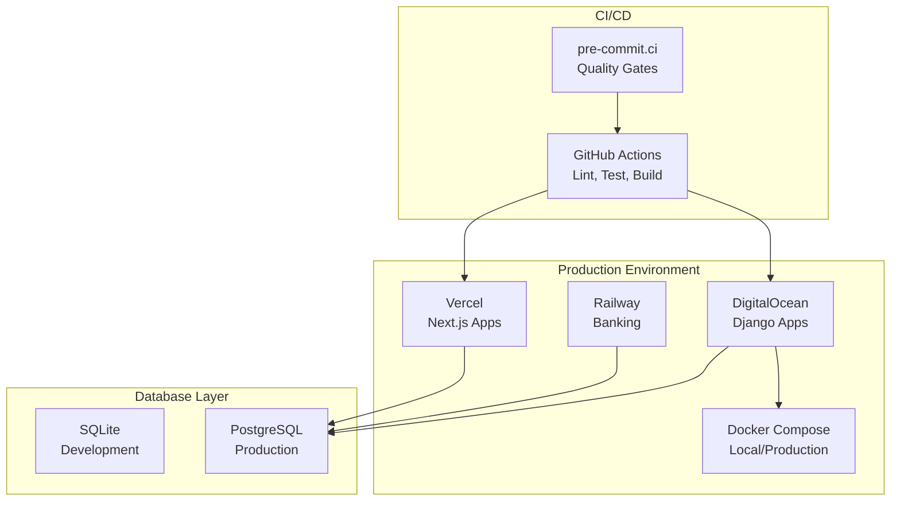

# Project Architecture Blueprint

**Generated:** 2026-07-28  
**Workspace:** `C:\Users\Alexa\Desktop\SandBox`  
**Architecture Pattern:** Multi-Project Monorepo with Heterogeneous Stacks  
**Diagram Type:** Mermaid C4 + Component + Flow Diagrams

---

## 1. Architecture Detection and Analysis

### Primary Architectural Pattern: Multi-Project Monorepo (Polyglot)

The SandBox workspace is a **polyglot monorepo** containing 22 autonomous subprojects across 9+ programming languages. The architecture follows a **containerized microservices-inspired model** where each subproject is independently developed, configured, and documented, sharing only workspace-level tooling conventions.

### Workspace Topology

```mermaid
graph TB
    subgraph "SandBox Monorepo Root"
        WS[Workspace Root<br/>Shared Configs & Tooling]
        GH[.github/prompts/<br/>Canonical Prompt Library]
        SCR[scripts/<br/>Automation & Pipeline Scripts]
        DOC[docs/<br/>Centralized Documentation]
    end

    subgraph "TypeScript / Bun Projects"
        BASH[projects/Bash<br/>Automation Toolkit]
        BANK[projects/Banking<br/>Fintech Next.js App]
        CW[projects/comicwise<br/>Comic Platform]
        RESUME[projects/Resume_maker<br/>PDF Generator]
        SELENIUM[projects/selenium_webdriver]
        UNIV[projects/university-libary-jsm<br/>Library System]
    end

    subgraph "Django / Python Projects"
        DJANGO[projects/Django-Scrapy-Selenium<br/>Full-Stack Scraper]
        ECOM[projects/ecom<br/>E-Commerce Backend]
        PROFILE[projects/profile<br/>Profile Service]
        XTV[projects/xamehi.tv<br/>Video Platform]
        RHB[projects/rhixe_scans/backend<br/>Scans Backend]
        RCB[projects/rhixecompany-comics/backend]
        CDJ[projects/cookiecutter-django-tailwind<br/>Template]
    end

    subgraph "Multi-Stack Full-Stack Apps"
        XAM[projects/xamehi<br/>React + Django]
        RC[projects/rhixecompany-comics<br/>Next.js + Django]
        RHS[projects/rhixe_scans<br/>Next.js + Django]
        ECOM_F[projects/ecom/frontend<br/>React Frontend]
    end

    subgraph "MCP Server Implementations"
        MCP[projects/mcp-servers<br/>Go, Rust, Java, Kotlin, PHP,<br/>Python, TypeScript, C#, Ruby, Swift]
    end

    subgraph "Utility Projects"
        PP[projects/Python-projects<br/>Python Scripts]
        YT[projects/youtube-downloader]
    end

    WS --> GH
    WS --> SCR
    WS --> DOC
    WS --> BASH
    WS --> BANK
    WS --> CW
    WS --> RESUME
    WS --> SELENIUM
    WS --> UNIV
    WS --> DJANGO
    WS --> ECOM
    WS --> PROFILE
    WS --> XTV
    WS --> CDJ
    WS --> XAM
    WS --> RC
    WS --> RHS
    WS --> ECOM_F
    WS --> MCP
    WS --> PP
    WS --> YT
```



### Technology Stack Distribution



---

## 2. Architectural Overview

### Guiding Principles

1. **Subproject Autonomy** — Each subproject has its own `AGENTS.md`, tech stack, dependency management, and CI pipeline. No shared runtime or cross-project runtime coupling.
2. **Shared Tooling Convention** — Workspace-root configs (`.editorconfig`, `.markdownlintrc.json`, `.prettierrc.ts`, `tsconfig.json`) provide consistent formatting and linting defaults.
3. **Documentation-First** — Every project has standardized doc files (`ARCHITECTURE.md`, `README.md`, `REPOSITORY_SUMMARY.md`, `TECHNOLOGY_STACK.md`, etc.) following hermetic documentation patterns.
4. **MCP-First Tooling** — The workspace prioritizes MCP server tools over native equivalents for development workflows.
5. **Prompt Library as API** — `.github/prompts/` serves as a canonical prompt library for agent-assisted development, with 60+ structured prompts.

### Architectural Boundaries

| Boundary            | Enforcement                                                            |
| ------------------- | ---------------------------------------------------------------------- |
| Project Isolation   | Separate `package.json`, `bun.lock`, or `requirements.txt` per project |
| Git Isolation       | Each project can have its own `.gitignore`, sometimes own git history  |
| Tooling Consistency | Shared root configs for linting, formatting, and EditorConfig          |
| Agent Guidance      | Per-project `AGENTS.md` files with project-specific rules              |

### Hybrid Adaptations

The workspace adapts a **monorepo-with-multiple-git-repos** hybrid model:

- Some projects share a single parent git repo (SandBox)
- The Banking project has its own independent `.git` directory (nested repo)
- Submodules are configured via `.gitmodules` for external references

---

## 3. Architecture Visualization

### High-Level Architecture Overview



### Component Interaction Diagram



### Data Flow Architecture

```mermaid
flowchart TD
    subgraph "Request Flow"
        USER[User Request] --> NEXT[Next.js Server<br/>App Router]
        NEXT --> API[API Routes<br/>/api/*]
        API --> DB[(Database<br/>SQLite/PostgreSQL)]
        API --> EXT[External APIs<br/>Plaid, Stripe, etc.]
    end

    subgraph "Django Request Flow"
        DJREQ[HTTP Request] --> NGINX[Nginx/Gunicorn]
        NGINX --> DJ[Django App]
        DJ --> DJDB[(SQLite/PostgreSQL)]
        DJ --> TEMPLATES[Django Templates]
    end

    subgraph "MCP Server Flow"
        MCPREQ[MCP Client] --> MCP_SRV[MCP Server<br/>stdio/HTTP]
        MCP_SRV --> SRC[Source Code<br/>Go, Rust, Java...]
        SRC --> TOOLS[Tool Implementations]
    end

    subgraph "Prompt Execution Flow"
        AGENT[AI Agent] --> PROMPT[Prompt Template<br/>.prompt.md]
        PROMPT --> WORKSPACE[Workspace Files]
        PROMPT --> TOOLS2[Agent Tools]
        WORKSPACE --> RESULT[Output]
    end
```



---

## 4. Core Architectural Components

### 4.1 TypeScript / Bun Next.js Applications

**Projects:** Banking, comicwise, rhixe_scans, university-libary-jsm, rhixecompany-comics/frontend, xamehi.tv/frontend, ecom/frontend

**Purpose and Responsibility:**

- Full-stack web applications using Next.js App Router
- Server-side rendering with React Server Components
- API endpoints via Next.js API routes
- Database access via Drizzle ORM or Prisma
- UI built with Tailwind CSS + shadcn/ui components

**Internal Structure:**

```
src/
├── app/           # Next.js App Router pages & API routes
│   ├── (auth)/   # Authentication-required routes
│   ├── (root)/   # Public/main routes
│   ├── admin/    # Admin panel routes
│   └── api/      # API route handlers
├── components/   # Reusable React components (shadcn/ui style)
├── actions/      # Server actions (Next.js Server Actions)
├── lib/          # Utility functions & shared logic
├── hooks/        # React custom hooks
├── styles/       # Global styles
└── assets/       # Static assets (SVGs, images)
```

**Interaction Patterns:**

- **Server Components** for data fetching → Client Components for interactivity
- **Server Actions** for form submissions and mutations
- **API Routes** for external integrations (Plaid, Clerk, Stripe)
- **Middleware** for route protection and auth checks

### 4.2 Django / Python Backend Services

**Projects:** ecom, profile, xamehi.tv, Django-Scrapy-Selenium, cookiecutter-django-tailwind, rhixe_scans/backend, rhixecompany-comics/backend

**Purpose and Responsibility:**

- RESTful API backends using Django REST Framework
- Database schema management via Django ORM migrations
- Web scraping pipelines (Scrapy + Selenium)
- Admin interfaces via Django Admin
- Template rendering for server-rendered pages

**Internal Structure (standard Django layout):**

```
project/
├── config/       # Settings (base, local, production)
├── api/          # REST API app
├── base/         # Core app with models
├── users/        # User management app
├── templates/    # Django templates
├── static/       # Static files
├── fixtures/     # Test data
├── compose/      # Docker Compose configs
│   ├── local/
│   └── production/
└── requirements/ # Split requirements files
```

### 4.3 MCP Server Implementations

**Location:** `projects/mcp-servers/`

**Purpose and Responsibility:**
Reference implementations of MCP (Model Context Protocol) servers across 10 languages:

- TypeScript, Go, Rust, Java, Kotlin, PHP, Python, C#, Ruby, Swift

**Interaction Patterns:**

- MCP stdio transport for local development
- Tool registration and discovery patterns
- Standardized server lifecycle (init → connect → handle → disconnect)

### 4.4 Automation & Scripting

**Projects:** Bash (TypeScript/Bun toolkit), Python-projects, youtube-downloader, selenium_webdriver

**Purpose and Responsibility:**

- Cross-platform automation scripts (Bash, PowerShell, Python)
- Video downloading and processing
- Selenium webdriver configurations
- Educational Python examples and utilities

---

## 5. Architectural Layers and Dependencies

### Layer Mapping



### Dependency Rules

| Layer             | Can Depend On                       | Cannot Depend On    |
| ----------------- | ----------------------------------- | ------------------- |
| UI Components     | Server Components, lib/utils, hooks | Direct data access  |
| Server Components | Data layer, API, lib                | Client-side state   |
| API Routes        | Data layer, external services       | UI components       |
| Django Views      | Models, Forms, Templates            | Raw HTTP handling   |
| Django Models     | Only itself + Django ORM            | Views, Templates    |
| MCP Tools         | Shared lib, external SDKs           | Project-specific UI |

---

## 6. Data Architecture

### Domain Models

**TypeScript Projects:**

- **Banking:** Users, Accounts, Transactions, Plaid integrations, Categories
- **comicwise:** Users, Comics, Chapters, Ratings, Comments, Bookmarks, Genres
- **university-library:** Books, Users, Auth sessions, Reading lists

**Django Projects:**

- **ecom:** Products, Categories, Orders, Cart, User profiles
- **Django-Scrapy-Selenium:** Scraped content, Crawl jobs, API endpoints
- **profile/xamehi.tv:** User profiles, Media content, Player state

### Data Access Patterns



### Caching Strategies

- **Next.js:** Built-in data cache, full route cache, ISR (Incremental Static Regeneration)
- **Django:** Template fragment caching, database query caching via cache framework

---

## 7. Cross-Cutting Concerns Implementation

### Authentication & Authorization

| Project            | Auth Approach                            |
| ------------------ | ---------------------------------------- |
| Banking            | Clerk (third-party auth)                 |
| comicwise          | Custom auth + session management         |
| university-library | NextAuth.js                              |
| Django projects    | django-allauth, JWT tokens, session auth |
| rhixe_scans        | Clerk + Django session bridging          |

### Error Handling & Resilience

- **TypeScript:** Server Action try/catch with error boundaries, React ErrorBoundary components
- **Django:** Standard Django exception handling, middleware-based error responses
- **Scripts:** Return code checking, verbose error reporting

### Logging & Monitoring

- **TypeScript:** Console logging in dev, structured logging patterns
- **Django:** Python logging module, Sentry integration (where configured)
- **Pre-commit:** Git hooks for linting/formatting before commits

### Validation

- **TypeScript:** Zod schemas for runtime validation, TypeScript strict mode
- **Django:** Form validation, Serializer validation (DRF), Model field validation
- **Cross-project:** Pre-commit hooks for lint + format + spellcheck

### Configuration Management

- **TypeScript:** `.env.local`, `app-config.ts`, environment variables via `process.env`
- **Django:** Split settings (base/local/production), `.env` files, docker-compose env vars
- **Shared:** `.gitignore` patterns for secrets, `.editorconfig` for encoding

---

## 8. Service Communication Patterns

### API Patterns by Project

| Project                | API Type                 | Auth          | Transport  |
| ---------------------- | ------------------------ | ------------- | ---------- |
| Banking                | Next.js API + App Router | Clerk JWT     | HTTP/JSON  |
| comicwise              | Next.js API Routes       | Session       | HTTP/JSON  |
| Django-Scrapy-Selenium | Django REST Framework    | Token/Session | HTTP/JSON  |
| ecom                   | Django REST              | Session       | HTTP/JSON  |
| mcp-servers            | MCP Protocol             | stdio/API key | stdio/HTTP |

### Communication Flows



---

## 9. Technology-Specific Architectural Patterns

### TypeScript / Bun Architectural Patterns

**Package Manager:** Bun 1.3+ (NOT npm/pnpm — enforced at workspace level)

**Key Patterns:**

- **Next.js App Router** — File-system based routing with layouts, loading states, error boundaries
- **Server Components** — Default rendering strategy for React components
- **Server Actions** — Form handling and data mutations without explicit API routes
- **shadcn/ui** — Copy-paste component library with Tailwind CSS theming
- **Drizzle ORM** — Type-safe SQL query builder and migration tool
- **Zod** — Runtime schema validation for API inputs and forms
- **Vitest** — Unit and integration testing

### Python / Django Architectural Patterns

**Key Patterns:**

- **MVT (Model-View-Template)** — Django's standard architectural pattern
- **Django REST Framework** — API view sets, serializers, permissions
- **Scrapy + Selenium** — Web scraping with JS-rendered content support
- **Split Settings** — Base/Local/Production configuration inheritance
- **Docker Compose** — Local and production deployment stacks
- **Gunicorn** — Production WSGI server
- **Celery** — Async task queue (where configured)

### MCP Server Patterns

- **stdio transport** — Standard I/O protocol for local tool execution
- **Tool registry** — Server-side tool discovery and schema exposition
- **Multi-language reference** — Same MCP protocol implemented across 10 languages

---

## 10. Implementation Patterns

### Next.js Server Action Pattern

```
// src/actions/some-action.ts
'use server';

import { z } from 'zod';
import { db } from '@/lib/db';

const schema = z.object({
  name: z.string().min(1),
  email: z.email(),
});

export async function createItem(formData: FormData) {
  const validated = schema.parse(Object.fromEntries(formData));
  return db.insert(schema).values(validated);
}
```

### Django View + Serializer Pattern

```
# views.py
from rest_framework import viewsets
from .models import Item
from .serializers import ItemSerializer

class ItemViewSet(viewsets.ModelViewSet):
    queryset = Item.objects.all()
    serializer_class = ItemSerializer
    permission_classes = [IsAuthenticated]
```

### MCP Server Tool Pattern (TypeScript)

```
// server.ts
import { Server } from '@modelcontextprotocol/sdk';

const server = new Server({ name: 'example', version: '1.0.0' });

server.tool('my-tool', { input: z.string() }, async ({ input }) => {
  return { content: [{ type: 'text', text: `Processed: ${input}` }] };
});
```

---

## 11. Testing Architecture

### Testing Strategy by Stack

| Layer                  | Tool            | Scope                         |
| ---------------------- | --------------- | ----------------------------- |
| TypeScript Unit        | Vitest          | Functions, utilities, hooks   |
| TypeScript Integration | Playwright      | E2E browser tests             |
| Django Unit            | pytest-django   | Models, views, serializers    |
| Django Integration     | pytest + client | API endpoint tests            |
| MCP Servers            | Language-native | Tool function testing         |
| Documentation          | markdownlint    | Formatting, structure         |
| Overall Quality        | pre-commit      | All lint + format + typecheck |

---

## 12. Deployment Architecture

### Deployment Topology



---

## 13. Extension and Evolution Patterns

### Adding a New Subproject

1. Create directory under `projects/<name>/`
2. Initialize with appropriate package manager (`bun init`, `django-admin startproject`, etc.)
3. Copy root-level tooling configs (`.editorconfig`, `.markdownlintrc.json`)
4. Create `AGENTS.md` with project-specific guidance
5. Create standard doc files: `README.md`, `ARCHITECTURE.md`, `TECHNOLOGY_STACK.md`
6. Add to workspace index in root `README.md`

### Modifying Existing Components

- Each subproject is fully isolated — changes don't affect others
- Follow per-project `AGENTS.md` conventions
- Run quality gates before committing (lint → typecheck → test)

### Integration Patterns

- **Cross-project data sharing:** Via REST APIs or shared databases
- **MCP server sharing:** MCP protocol enables any client to use any server
- **Prompt library reuse:** Prompts in `.github/prompts/` can be used across all projects

### Extension Points

| Extension Point       | Mechanism                                   |
| --------------------- | ------------------------------------------- |
| New MCP server        | Add directory under `projects/mcp-servers/` |
| New prompt            | Add `.prompt.md` under `.github/prompts/`   |
| New automation script | Add to `scripts/`                           |
| New shared config     | Add to workspace root                       |

---

## 14. Architecture Governance

### Consistency Maintenance

- **Root-level tooling** enforces consistent formatting (`.editorconfig`) and linting (`.markdownlintrc.json`)
- **AGENTS.md** per project ensures agent-aware development
- **Pre-commit hooks** enforce quality gates before commits
- **Documentation templates** provide standardized project documentation

### Automated Compliance Checks

- ESLint with `max-warnings=0` for TypeScript
- Ruff + Pyright for Python
- markdownlint for documentation
- CSpell for spelling
- Prettier for formatting
- Yamllint for YAML files

---

## 15. Blueprint for New Development

### Development Workflow

1. **Choose project** — Pick or create the appropriate subproject
2. **Follow AGENTS.md** — Read project-specific agent guidance
3. **Set up environment** — Install deps (`bun install`, `pip install -r requirements.txt`)
4. **Run quality gates** — Lint, format, typecheck before writing code
5. **Implement** — Follow existing patterns in the project
6. **Test** — Run Vitest, pytest, or Playwright as appropriate
7. **Verify before commit** — Run pre-commit hooks

### Starting Points by Feature Type

| Feature Type     | Starting Point                             |
| ---------------- | ------------------------------------------ |
| New Next.js page | `src/app/<route>/page.tsx`                 |
| New API endpoint | `src/app/api/<name>/route.ts`              |
| New Django model | `api/models.py`                            |
| New Django view  | `api/views.py`                             |
| New MCP tool     | `tools/<tool-name>.ts` in mcp-server       |
| New script       | `scripts/<name>.py` or `scripts/<name>.sh` |

### Common Pitfalls

| Pitfall                | Mitigation                                                      |
| ---------------------- | --------------------------------------------------------------- |
| Cross-project coupling | Keep projects isolated — don't import across project boundaries |
| Missing lint           | Run `bun run lint:strict` before commit                         |
| Outdated docs          | Regenerate architecture docs when structure changes             |
| Environment drift      | Use `.env.example` and docker-compose for reproducible setups   |
| Ignoring AGENTS.md     | Always check per-project agent guidance first                   |

---

**Update Frequency:** Regenerate this blueprint when project roots, dependencies, or folder structure change significantly. Per-project docs should be regenerated individually as their codebases evolve.

**Next Review:** 2026-08-28
