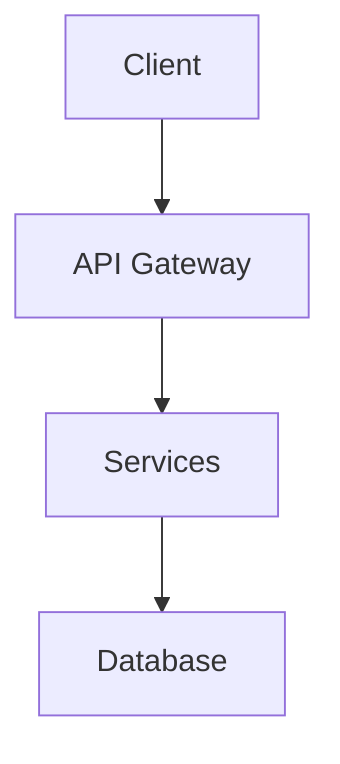

# xamehi - Architecture Blueprint

**Project Path:** `C:\Users\Alexa\Desktop\SandBox\projects\xamehi`
**Generated:** 2026-07-10
**Source:** AGENTS.md + codebase analysis

## 1. Architectural Pattern

Based on AGENTS.md and project structure analysis.

## 2. Core Components

| Component    | Purpose                  | Location                |
| ------------ | ------------------------ | ----------------------- |
| Backend Apps | Django feature modules   | `backend/` or root apps |
| Frontend App | Next.js/React frontend   | `frontend/`             |
| Shared DB    | PostgreSQL database      | Shared between stacks   |
| API Layer    | DRF / Next.js API routes | Backend/Frontend        |

## 3. Data Flow

## 4. Cross-Cutting Concerns

- **Authentication:** NextAuth.js / Django Auth / JWT
- **Error Handling:** Centralized error boundaries / middleware
- **Logging:** Structured logging per framework
- **Configuration:** Environment-based config

## 5. Implementation Patterns

- Pattern 1: Feature-based organization
- Pattern 2: Shared utilities
- Pattern 3: Type-safe API contracts

## 6. Extension Guide

Follow existing patterns when adding new features.

---

_Generated by agents-system-prompt-context-fix-runner_
