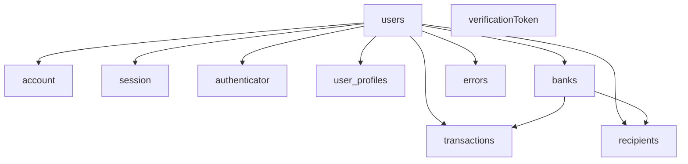

# Full-schema database seeder

## Goals

- Provide a runnable dev seed (aligned with [docs/GetStartedWithDrizzleAndPostgreSQL-context.md](docs/GetStartedWithDrizzleAndPostgreSQL-context.md) Step 7–8: `tsx scripts/seed/run.ts`) that populates **all** tables: `users`, `account`, `session`, `verificationToken`, `authenticator`, `user_profiles`, `banks`, `transactions`, `recipients`, `errors`.
- Centralize deterministic IDs and small **helper builders** so inserts stay type-safe (no `any`) and FK order is obvious.

## Scope

- New files under `scripts/seed/` only, plus one `package.json` script (e.g. `db:seed`) for discoverability.
- No changes to [database/schema.ts](database/schema.ts) or runtime app code unless a missing export is strictly required (unlikely).

## Dependency and insert order (FK-aware)

- **Independent**: `verificationToken` (no FK to `users`).
- **After `users`**: `account`, `session`, `authenticator`, `user_profiles`.
- **After `users` and before rows that reference banks**: `banks` (`access_token` not null, `sharable_id` unique — use distinct placeholder values per row).
- **After `banks`**: `transactions` (`sender_bank_id` / `receiver_bank_id` optional FKs), `recipients` (`bank_account_id` optional).
- **Any time after `users`**: `errors` (optional `user_id`).

## Target files

| File | Role |
| --- | --- |
| [scripts/seed/run.ts](scripts/seed/run.ts) | CLI entry: load env, optional `--reset`, call truncate then `seedAll()`, exit codes, console summary. |
| [scripts/seed/seed-data.ts](scripts/seed/seed-data.ts) | Fixed UUID/email constants; helpers: `hashSeedPassword`, row builders returning `typeof table.$inferInsert` (or narrow partials where defaults apply); `seedAll(db)` performing ordered `insert`s. |
| [package.json](package.json) | Add `db:seed` → `tsx scripts/seed/run.ts`. |

## Implementation notes (match existing app behavior)

- **Passwords**: Use `bcrypt` `hash(..., 12)` like [actions/register.ts](actions/register.ts) / [lib/auth-options.ts](lib/auth-options.ts). Document a single known dev password (e.g. same as E2E tests: `password123`) in a one-line comment in `seed-data.ts` only. // docs: updated snippet — verify vs. source
- **Bank `access_token`**: Store encrypted — either call `[bankDal.createBank](dal/bank.dal.ts)` (preferred, single encryption path) or `encrypt()` from `[lib/encryption.ts](lib/encryption.ts)` before `insert`. Requires valid `ENCRYPTION_KEY` via `[lib/env.ts](lib/env.ts)` when those modules load.
- `**transactions.amount**`: Drizzle `numeric` — use string decimals (e.g. `"100.00"`) consistent with PostgreSQL expectations.
- **NextAuth-shaped rows**: For `account`, `session`, `authenticator`, use plausible placeholder values (composite PKs on `account` and `authenticator`, `sessionToken` PK on `session`) so inserts validate; no need to mirror real OAuth/WebAuthn bytes beyond non-empty strings.
- **Optional reset**: Implement safe truncate for **development only**: e.g. if `NODE_ENV === "production"` then refuse unless `ALLOW_DB_SEED=true` (or similar), and document that `DATABASE_URL` must point at a dev database. Use Drizzle `sql` + `TRUNCATE ... CASCADE` listing all schema tables (quote mixed-case identifiers like `"verificationToken"` / `"session"` as in PostgreSQL).

## Risks

| Risk | Mitigation |
| --- | --- |
| Accidental seed against production | Guard in `run.ts`; document `ALLOW_DB_SEED` + dev-only use in script header. |
| FK / unique violations on re-run | Default flow: `--reset` truncate first; document idempotent workflow. |
| Env validation fails on import | Seed imports `db` and encryption/DAL — same `.env` as local app (`DATABASE_URL`, `ENCRYPTION_KEY`, `NEXTAUTH_SECRET`, etc.). |

## Validation

- `npm run type-check`
- `npm run lint:strict` (or narrow ESLint to new files if the repo supports it)
- Manual: `npm run db:seed` (or `npm exec tsx scripts/seed/run.ts -- --reset`) against a local DB after `db:push` / migrations; verify row counts per table.

## Rollback or mitigation

- Remove `db:seed` script and delete `scripts/seed/`; no schema migrations required.
