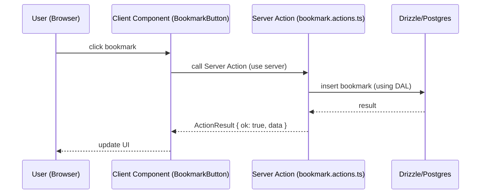

# Project Architecture Blueprint — ComicWise

Generated: 2026-03-23

## Table of Contents

1. Executive summary
2. Technology stack (detected)
3. Architectural overview
4. Diagrams (container & component)
5. Core architectural components
6. Layers and dependencies
7. Data architecture
8. Cross-cutting concerns
9. Service communication patterns
10. Technology-specific patterns
11. Implementation patterns & examples
12. Testing architecture
13. Deployment architecture
14. Extension and evolution patterns
15. Architecture governance
16. Blueprint for new development

---

## 1. Executive summary

ComicWise is a production-ready, feature-rich manga/comics reader built as a modular monolithic Next.js application (App Router) with Server Components by default. The codebase emphasizes type safety (TypeScript), correctness (Zod validation), and maintainability (DAL abstractions, strict quality gates). This document captures the current architecture, implementation patterns, and practical guidance for extending the system.

## 2. Technology stack (detected)

- Platform: Node.js + Next.js 16.1.6 (App Router, Server Components)
- UI: React 19.2.4 (Server & Client Components), shadcn/ui + Radix UI primitives, Tailwind CSS v4
- Language: TypeScript 5.9.x (strict mode, no `any`)
- ORM/DB: Drizzle ORM (postgres-js) + PostgreSQL (Neon recommended)
- Auth: NextAuth v5 with database sessions + NextAuth adapter
- Validation: Zod v4
- State: Zustand for client state
- Testing: Vitest (unit) and Playwright (E2E)
- Tooling: Turbopack (build), React Compiler, pnpm
- Seeding & scripts: src/scripts/seed (template-method pattern)

## 3. Architectural overview

Primary pattern: a layered, feature-oriented monolith that blends clean/layered architecture principles. The app splits responsibilities into:

- Presentation: `app/` routes & components (Server Components by default, small client bundles for interactivity)
- Domain & Application: Server Actions, DAL, domain services in `src/actions/`, `src/dal/`
- Data: Drizzle schema & database access in `src/database/` and `src/dal/`
- Scripts & Ops: `src/scripts/` (seeders, triage, tooling)

Guiding principles observed:

- Type safety first: no `any`, use $inferSelect from Drizzle
- Auth-first checks in server actions: `await auth()` as first line
- No raw environment reads: use getEnv() from appConfig
- Server Actions for mutations (no API routes for writes)
- Eager loading via `.with()` to avoid N+1 queries

## 4. Diagrams

Note: diagrams are expressed in mermaid for easy edit and preview.

### 4.1 Container/Boundary diagram

```mermaid
flowchart LR
  Browser[Browser / Client] -->|HTTP/SSR| NextApp[Next.js App Router (Server Components)]
  NextApp -->|Server Actions| Actions[Server Actions (src/actions)]
  NextApp -->|DAL| DAL[src/dal (BaseDal + concrete DALs)]
  DAL -->|SQL| Postgres[(PostgreSQL via Drizzle)]
  NextApp -->|Auth| NextAuth[NextAuth v5]
  Browser -->|JS bundles| ClientUI[Client Components (Zustand, shadcn)]
  NextApp -->|Static assets| CDN[public/ + CDN]
  NextApp -->|Scripts| Seeders[src/scripts/seed]
```

### 4.2 Component interaction (example: bookmark flow)



## 5. Core architectural components

### app/

- Purpose: Route handlers and page composition using the App Router. Server Components by default; client components explicitly marked with `"use client"`.
- Key responsibilities: page-level data fetching, layout composition, error/loading boundaries.

### components/

- Purpose: UI primitives and feature components (ui/, comics/, reader/). Reusable shadcn primitives and Radix UI for accessibility.
- Interaction: client components handle interactivity; server components provide data and composition.

### dal/

- Purpose: Data Access Layer. All DAL classes extend BaseDal<T> to provide list/get/create/update/delete and to enforce consistency.
- Patterns: use Drizzle query builders, $inferSelect types, eager loading `.with()`, return `null` on not-found.

### database/

- Purpose: Drizzle schema declaration (27 tables), db singleton, migrations.
- Note: use cascade deletes, typed enums, and carefully defined FK constraints.

### actions/

- Purpose: Server Actions (mutations). Follow ActionResult pattern: never throw; return typed { ok, data } or { ok, error }.
- Security: always call `await auth()` first, validate inputs with Zod.

### scripts/

- Purpose: seeding, triage, maintenance scripts. Seed system follows Template Method and LookupCache discipline.

## 6. Layers and dependencies

Layer mapping (high-level):

- Presentation (app/, components/) -> Application (actions/, hooks/) -> Domain (dal/, services/) -> Persistence (database/, Drizzle)

Dependency rules:

- Higher layers depend on lower-layer _abstractions_ (DAL interfaces) not implementations.
- Use BaseDal and type-safe returns to decouple.
- No circular dependencies; watch for imports crossing features.

## 7. Data architecture

- Domain model centralized in Drizzle schema (src/database/schema.ts). Entities mapped to TypeScript types via Drizzle's $inferSelect.
- Relations use FK constraints and `ON DELETE CASCADE` where appropriate.
- Data access patterns: repository-style DAL classes, use of transactions for multi-step mutations.
- Caching: client-side caching via React Query / query-client; server-side caching via Next.js caching primitives when used.

## 8. Cross-cutting concerns

### Authentication & Authorization

- NextAuth v5 for session management with DB-backed sessions.
- Server Actions perform `await auth()` and then role-checking. Follow deny-by-default principle.

### Validation

- Zod schemas (src/schemas) validate all external inputs before DB access.

### Error handling & resilience

- Server Actions return ActionResult; errors are surfaced as structured results.
- Use try/catch in DAL with consistent error wrapping; report to observability.

### Logging & monitoring

- Instrumentation points exist in scripts and actions. Recommend centralized logging and structured JSON logs.

### Configuration & secrets

- Use getEnv() (appConfig.ts) for validated environment variables. Secrets remain in environment or secret manager; do not read raw process.env.

## 9. Service communication patterns

- Current deployment is a single app (monolith). Communication is intra-process or via DB.
- If integrating external services, prefer HTTP(S) with strict allow-list validation, or async messaging with clear schemas.
- API versioning: route-based versioning when breaking changes are required.

## 10. Technology-specific patterns

### Next.js / React

- Server Components by default; only use `"use client"` where interactivity needed.
- Data fetching in server components (async) and pass props to client components.
- No manual memoization (React Compiler handles optimizations).

### Drizzle / Postgres

- Use query builders; avoid raw SQL. Use `.with()` to eager-load relations.
- Use $inferSelect for types; DAL returns typed rows or null.

### Seeding system

- Template Method pattern with LookupCache for relation resolution.

## 11. Implementation patterns & examples

### 11.1 Server Action: ActionResult pattern

```typescript
// example: src/actions/bookmark.actions.ts
"use server";
import { z } from "zod";
import { auth } from ".."; // auth helper
import { db, bookmark } from "@/database/db";

type ActionResult<T> =
  | { ok: true; data: T }
  | { ok: false; error: string };

export async function createBookmark(
  input: unknown
): Promise<ActionResult<{ id: string }>> {
  const schema = z.object({ comicId: z.string() });
  const parsed = schema.safeParse(input);
  if (!parsed.success) return { ok: false, error: "Invalid input" };

  const session = await auth();
  if (!session) return { ok: false, error: "Not authenticated" };

  const res = await db
    .insert(bookmark)
    .values({ userId: session.user.id, comicId: parsed.data.comicId })
    .returning();
  if (res.length === 0) return { ok: false, error: "Insert failed" };
  return { ok: true, data: { id: res[0].id } };
}
```

### 11.2 DAL example (BaseDal pattern)

```typescript
// src/dal/base-dal.ts (concept)
export abstract class BaseDal<T> {
  abstract list(options?: {
    limit?: number;
    offset?: number;
  }): Promise<T[]>;
  abstract getById(id: string): Promise<T | null>;
  // common helpers for transactions, eager loading, mapping
}
```

## 12. Testing architecture

- Unit tests: Vitest, jsdom for UI tests.
- E2E: Playwright running against staging or test deploys; tests include accessibility snapshots and visual checks.
- Mocks: tests use mock DB or test DB with seeders.

## 13. Deployment architecture

- Development: `pnpm dev` (Turbopack)
- Quality gates before PR: `pnpm lint:strict && pnpm triage && pnpm type-check && pnpm test && pnpm build`
- Containerization: Dockerfile + docker-compose present; recommend multi-stage builds and image signing for prod pipeline.
- Database migrations: pnpm db:push / pnpm db:migrate depending on environment.

## 14. Extension and evolution patterns

- Add new features under `app/<feature>` for routes and `components/<feature>` for UI. Use DAL `src/dal/<entity>-dal.ts` for data access and add seeder under `src/scripts/seed/` if initial data required.
- For integrations, add an adapter layer in `src/lib/adapters` and register via DI where appropriate.
- Follow the project's rules (no raw SQL, update timestamps on mutations, use ActionResult, validate with Zod).

## 15. Architecture governance

- Automated checks: lint:strict, type-check, test, build — all must pass before merging.
- Documentation: keep this blueprint updated in repo root; add ADRs for significant changes under `.github/adr/` (recommended).
- Reviews: Architectural changes should go through the `architect` & `se-technical-writer` agents or team review.

## 16. Blueprint for new development (quick start)

- To add a new read-only page:
  1. Create server component page in `app/<path>/page.tsx`.
  2. Add DAL method if new data access is required.
  3. Add tests: unit test for small logic; integration or Playwright test if necessary.

- To add a new mutation:
  1. Implement Server Action in `src/actions/` with Zod validation and `await auth()`.
  2. Add DAL method for DB writes and ensure updatedAt is set.
  3. Add tests and update seeders if test data required.

- Templates: follow file naming conventions (e.g., `comic-dal.ts`, `bookmark.actions.ts`, `comic.schema.ts`).

## 17. Recommendations & next steps

- Create ADRs for any proposed architectural changes.
- Add a `docs/architecture/` folder for diagrams in source-controlled vector form (mermaid or drawio exports).
- Integrate image signing and OIDC for deployments.
- Periodically run dependency SCA and Docker image scans.

---

If desired, this document can be expanded into separate per-component diagrams, an ADR set, and a PDF for distribution to stakeholders.
