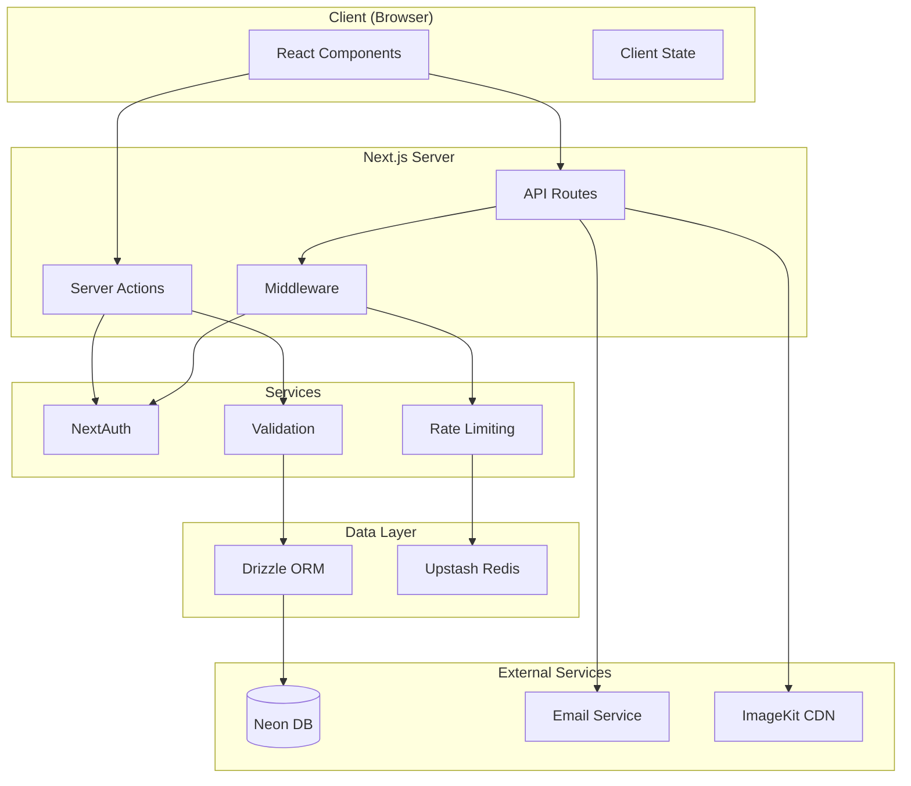

# Architecture

## Overview

BookWise is a full-stack Next.js 15 application using the App Router architecture. It follows a server-side rendering pattern with client components for interactivity. The application uses a layered architecture with clear separation between presentation, business logic, and data access layers.

## System Context



## Application Structure

### Route Hierarchy

```
app/
├── (auth)/                  # Authentication routes
│   ├── sign-in/
│   └── sign-up/
├── (root)/                  # Authenticated user routes
│   ├── books/[id]/          # Book details
│   ├── library/            # Book browsing
│   ├── my-profile/         # User profile
│   └── page.tsx            # Home dashboard
├── admin/                   # Admin panel
│   ├── account-requests/  # User approval
│   ├── book-requests/      # Borrow requests
│   ├── books/              # Book management
│   ├── users/              # User management
│   └── page.tsx            # Admin dashboard
├── api/                     # API endpoints
│   ├── auth/[...nextauth]  # NextAuth handlers
│   ├── imagekit/           # Image upload
│   └── workflows/          # Background jobs
└── fonts/                   # Custom fonts
```

### Key Directories

| Directory | Purpose |
|-----------|---------|
| `components/ui/` | Reusable UI components (shadcn) |
| `components/admin/` | Admin-specific components |
| `lib/actions/` | Server actions for mutations |
| `lib/queries/` | Database query functions |
| `database/` | Drizzle schema and config |
| `emails/` | Email templates (React Email) |

## Data Model

### Core Entities

```typescript
// Users - Library members
users {
  id: uuid (PK)
  fullName: string
  email: string (unique)
  universityId: number (unique)
  password: string (hashed)
  universityCard: string
  status: PENDING | APPROVED | REJECTED
  role: USER | ADMIN
  createdAt: timestamp
}

// Books - Library catalog
books {
  id: uuid (PK)
  title: string
  author: string
  genre: text
  rating: number
  coverUrl: string
  coverColor: string
  description: text
  totalCopies: number
  availableCopies: number
  videoUrl: string
  summary: string
  createdAt: timestamp
}

// Borrow records
borrowRecords {
  id: uuid (PK)
  userId: uuid (FK)
  bookId: uuid (FK)
  borrowDate: timestamp
  dueDate: date
  returnDate: date?
  status: BORROWED | RETURNED
  createdAt: timestamp
}
```

## Security Architecture

### Authentication Flow

1. User submits credentials via sign-in form
2. NextAuth CredentialsProvider validates against database
3. JWT token generated with user role embedded
4. Middleware enforces route protection based on role
5. Session refreshes on client via useSession hook

### Rate Limiting

- Upstash Redis-based rate limiting
- Configured per-endpoint in `lib/ratelimit.ts`
- Default: 10 requests per 10 seconds for API routes

## External Integrations

### Neon Database
- Serverless PostgreSQL
- Connection via `@neondatabase/serverless`
- Drizzle ORM for type-safe queries

### Upstash
- Redis for rate limiting
- Workflow state management

### ImageKit
- CDN for book cover images
- Upload via `/api/imagekit` route

### Email (React Email + Nodemailer)
- `user-welcome.tsx` - New user welcome
- `reset-password.tsx` - Password reset
- `weekly-digest.tsx` - Weekly activity digest

## Component Architecture

### UI Layer Pattern

```typescript
// Server Component (default)
export default async function Page() {
  const data = await fetchData();
  return <Component data={data} />;
}

// Client Component (interactive)
'use client';
export function InteractiveComponent() {
  const [state, setState] = useState();
  return <button onClick={...}>Action</button>;
}
```

### Server Actions

Mutations use Server Actions in `lib/actions/`:
- `auth.ts` - Authentication-related actions
- `book.ts` - Book borrowing operations
- `user.ts` - User profile updates
- `admin/actions/book.ts` - Admin book management
- `admin/actions/user.ts` - Admin user management

## Configuration

### Environment Variables

| Variable | Purpose |
|----------|---------|
| `DATABASE_URL` | Neon PostgreSQL connection |
| `NEXTAUTH_SECRET` | JWT signing key |
| `NEXTAUTH_URL` | App URL for auth |
| `UPSTASH_REDIS_REST_URL` | Upstash Redis |
| `UPSTASH_REDIS_REST_TOKEN` | Upstash auth |
| `IMAGEKIT_PUBLIC_KEY` | ImageKit API key |
| `IMAGEKIT_PRIVATE_KEY` | ImageKit secret |
| `SMTP_HOST` | Email server |
| `SMTP_USER` | Email credentials |
| `SMTP_PASS` | Email password |

## Performance Considerations

- Server Components by default for data fetching
- Client components only where interactivity needed
- React Server Components for reduced bundle size
- Edge-compatible database driver for fast cold starts

## Deployment

- Vercel recommended for Next.js deployment
- Neon serverless scales to zero
- Upstash Redis for rate limiting
# Architecture

## Overview

BookWise is a full-stack Next.js 15 application using the App Router architecture. It follows a server-side rendering pattern with client components for interactivity. The application uses a layered architecture with clear separation between presentation, business logic, and data access layers.

## System Context


## Application Structure

### Route Hierarchy

```
app/
├── (auth)/                  # Authentication routes
│   ├── sign-in/
│   └── sign-up/
├── (root)/                  # Authenticated user routes
│   ├── books/[id]/          # Book details
│   ├── library/            # Book browsing
│   ├── my-profile/         # User profile
│   └── page.tsx            # Home dashboard
├── admin/                   # Admin panel
│   ├── account-requests/  # User approval
│   ├── book-requests/      # Borrow requests
│   ├── books/              # Book management
│   ├── users/              # User management
│   └── page.tsx            # Admin dashboard
├── api/                     # API endpoints
│   ├── auth/[...nextauth]  # NextAuth handlers
│   ├── imagekit/           # Image upload
│   └── workflows/          # Background jobs
└── fonts/                   # Custom fonts
```

### Key Directories

| Directory | Purpose |
|-----------|---------|
| `components/ui/` | Reusable UI components (shadcn) |
| `components/admin/` | Admin-specific components |
| `lib/actions/` | Server actions for mutations |
| `lib/queries/` | Database query functions |
| `database/` | Drizzle schema and config |
| `emails/` | Email templates (React Email) |

## Data Model

### Core Entities

```typescript
// Users - Library members
users {
  id: uuid (PK)
  fullName: string
  email: string (unique)
  universityId: number (unique)
  password: string (hashed)
  universityCard: string
  status: PENDING | APPROVED | REJECTED
  role: USER | ADMIN
  createdAt: timestamp
}

// Books - Library catalog
books {
  id: uuid (PK)
  title: string
  author: string
  genre: text
  rating: number
  coverUrl: string
  coverColor: string
  description: text
  totalCopies: number
  availableCopies: number
  videoUrl: string
  summary: string
  createdAt: timestamp
}

// Borrow records
borrowRecords {
  id: uuid (PK)
  userId: uuid (FK)
  bookId: uuid (FK)
  borrowDate: timestamp
  dueDate: date
  returnDate: date?
  status: BORROWED | RETURNED
  createdAt: timestamp
}
```

## Security Architecture

### Authentication Flow

1. User submits credentials via sign-in form
2. NextAuth CredentialsProvider validates against database
3. JWT token generated with user role embedded
4. Middleware enforces route protection based on role
5. Session refreshes on client via useSession hook

### Rate Limiting

- Upstash Redis-based rate limiting
- Configured per-endpoint in `lib/ratelimit.ts`
- Default: 10 requests per 10 seconds for API routes

## External Integrations

### Neon Database
- Serverless PostgreSQL
- Connection via `@neondatabase/serverless`
- Drizzle ORM for type-safe queries

### Upstash
- Redis for rate limiting
- Workflow state management

### ImageKit
- CDN for book cover images
- Upload via `/api/imagekit` route

### Email (React Email + Nodemailer)
- `user-welcome.tsx` - New user welcome
- `reset-password.tsx` - Password reset
- `weekly-digest.tsx` - Weekly activity digest

## Component Architecture

### UI Layer Pattern

```typescript
// Server Component (default)
export default async function Page() {
  const data = await fetchData();
  return <Component data={data} />;
}

// Client Component (interactive)
'use client';
export function InteractiveComponent() {
  const [state, setState] = useState();
  return <button onClick={...}>Action</button>;
}
```

### Server Actions

Mutations use Server Actions in `lib/actions/`:
- `auth.ts` - Authentication-related actions
- `book.ts` - Book borrowing operations
- `user.ts` - User profile updates
- `admin/actions/book.ts` - Admin book management
- `admin/actions/user.ts` - Admin user management

## Configuration

### Environment Variables

| Variable | Purpose |
|----------|---------|
| `DATABASE_URL` | Neon PostgreSQL connection |
| `NEXTAUTH_SECRET` | JWT signing key |
| `NEXTAUTH_URL` | App URL for auth |
| `UPSTASH_REDIS_REST_URL` | Upstash Redis |
| `UPSTASH_REDIS_REST_TOKEN` | Upstash auth |
| `IMAGEKIT_PUBLIC_KEY` | ImageKit API key |
| `IMAGEKIT_PRIVATE_KEY` | ImageKit secret |
| `SMTP_HOST` | Email server |
| `SMTP_USER` | Email credentials |
| `SMTP_PASS` | Email password |

## Performance Considerations

- Server Components by default for data fetching
- Client components only where interactivity needed
- React Server Components for reduced bundle size
- Edge-compatible database driver for fast cold starts

## Deployment

- Vercel recommended for Next.js deployment
- Neon serverless scales to zero
- Upstash Redis for rate limiting
- Environment variables via Vercel project settings
