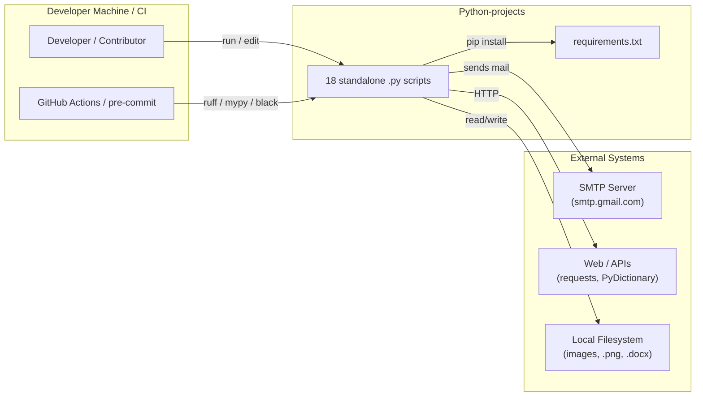
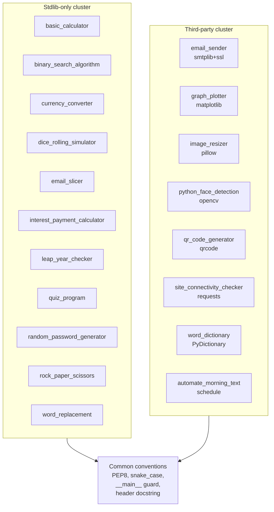
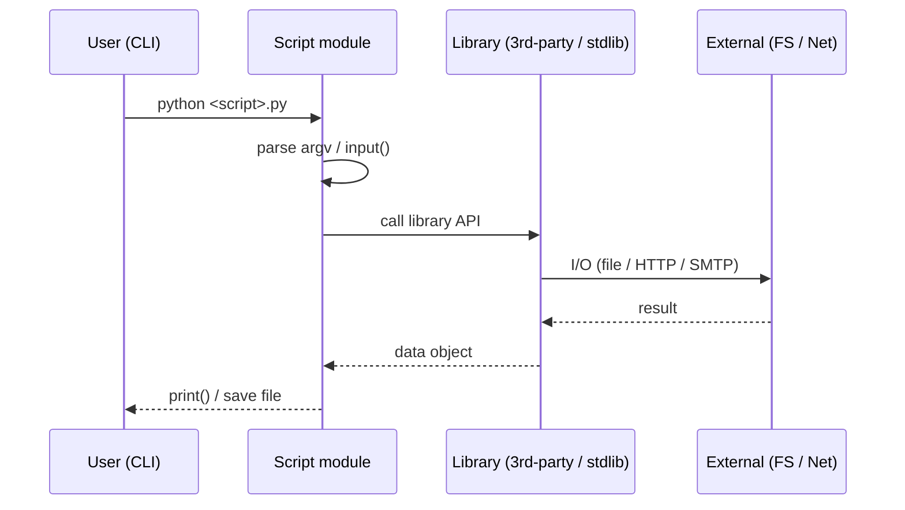

# Project Architecture Blueprint — `Python-projects`

> **Generated by:** `architecture-blueprint-generator` (v1.0.0)
> **Subject workspace:** `C:\Users\Alexa\Desktop\SandBox\projects\Python-projects`
> **Generated:** 2026-07-09
> **Dry-run note:** Per-task fallback. The authoritative prompt body (`prompts/architecture-blueprint-generator.prompt.md`) references `templates/architecture-blueprint-generator/*.md`, which are **not present** in the workspace. This blueprint was produced from the inline prompt body + direct evidence read from the component. All facts below are drawn from real files, not the missing templates.

---

## 1. Architecture Detection & Analysis

| Attribute | Detected Value | Evidence |
|---|---|---|
| **Project type** | `Python` (script collection) | `README.md` line 3; `.py` files throughout |
| **Architecture pattern** | `Monolithic — single-file modular scripts` (no framework, no shared core) | `AGENTS.md` "Single-file modular scripts, no framework"; each `.py` is self-contained |
| **Diagram type** | `C4 (Context + Container/Component)` rendered as Mermaid | best fit for a script collection |
| **Detail level** | `Comprehensive` | goal of generator |
| **Code examples** | `true` | samples read directly below |
| **Implementation patterns** | `true` | §5 |
| **Decision records** | `true` | §7 |
| **Extensibility focus** | `true` | §6 |

**Inventory (18 scripts, 474 LOC total):**

| Script | LOC | Domain | External dep |
|---|---:|---|---|
| `basic_calculator.py` | 44 | Math utility | stdlib only |
| `binary_search_algorithm.py` | 25 | Algorithm demo | stdlib only |
| `currency_converter.py` | 13 | Finance (CLI input) | stdlib only |
| `dice_rolling_simulator.py` | 60 | Game | `random` (stdlib) |
| `email_sender.py` | 31 | Network (SMTP) | stdlib `smtplib`, `ssl`, `os` |
| `email_slicer.py` | 16 | String utility | stdlib |
| `graph_plotter.py` | 15 | Visualization | `matplotlib` |
| `image_resizer.py` | 14 | Image processing | `pillow` |
| `interest_payment_calculator.py` | 15 | Finance | stdlib |
| `leap_year_checker.py` | 13 | Date utility | stdlib |
| `python_face_detection.py` | 17 | CV | `opencv-python` |
| `qr_code_generator.py` | 16 | Code generation | `qrcode` |
| `quiz_program.py` | 49 | Game/education | stdlib |
| `random_password_generator.py` | 30 | Security utility | stdlib |
| `rock_paper_scissors.py` | 66 | Game | `random` (stdlib) |
| `site_connectivity_checker.py` | 14 | Network probe | `requests` |
| `word_dictionary.py` | 10 | Dictionary API | `PyDictionary` |
| `word_replacement.py` | 7 | String utility | stdlib |
| `automate_morning_text.py` | 19 | Scheduling | `schedule` |

**Supporting files:** `requirements.txt` (pinned deps, dev + runtime), `README.md`, `AGENTS.md`, `CONTRIBUTING.md`, `CODE_OF_CONDUCT.md`, `LICENSE`, `docs/` (audit-report, CODE_DOCS, SETUP, triage-context, `.docx`), `.github/` (copilot-instructions, issue/PR templates), `.vscode/` (launch/settings/tasks), `.gitignore`, `.ruff_cache`.

---

## 2. Context Diagram (C4 Level 1)

---

## 3. Container / Component Diagram (C4 Level 2)

---

## 4. Runtime / Execution Model

Every script is invoked directly (`python script.py`) — there is no `main()` orchestrator, no package `__init__`, no service process. The shared "component" is purely **convention**, not shared code.

---

## 5. Implementation Patterns (with real examples)

**P1 — Plain `input()` REPL loop (no `argparse`)**
Most scripts read from stdin. `basic_calculator.py` (lines 14–44) uses an infinite `while True:` menu with `input()` and `int(input(...))`. Pattern: menu → branch → call pure function → `print`.
*Observation:* `basic_calculator.py` lacks `if __name__ == "__main__":` guard, unlike the README's stated convention — a real inconsistency (see §7 ADR-3).

**P2 — Third-party import + thin wrapper function**
`qr_code_generator.py` (lines 1–16) imports `qrcode`, defines `generate_qrcode(text)`, then calls it with user input. Hardcoded output `"qrimg001.png"` (no path arg — extensibility gap, §6).

**P3 — Environment-variable secrets (partial)**
`email_sender.py` (lines 6–14) reads `EMAIL_SENDER/EMAIL_PASSWORD/EMAIL_RECEIVER` from `os.environ` — the one security-positive pattern in the repo. But it hardcodes `smtp.gmail.com:465` and `subject`, and has a typo `em[' subject']` (leading space) on line 23 that breaks the header.

**P4 — Random-driven game logic**
`rock_paper_scissors.py` (lines 1–66) uses `random.choice` + nested `if/elif` scoreboard. Note line 65 `elif user_input != " rock" ...` has a logic bug (never triggers correctly due to stray space and `or` chain).

**P5 — Quality tooling (not enforced in code)**
`requirements.txt` pins `ruff==0.11.2`, `mypy==1.15.0`, `black==25.1.0`, `pytest==8.3.5`, `pre-commit`. `.github/` + `.vscode/` configure contributor tooling, but no `pytest` tests exist for the 18 scripts.

---

## 6. Extensibility & Extension Points

| Extension point | Current state | Recommended shape |
|---|---|---|
| **New script** | Copy a single `.py`, add to `README` manually | Add `scripts/` dir + `pyproject.toml` entrypoints; auto-generate README table |
| **Shared utilities** | None (duplicated `input()`/validation) | Extract `common/io.py`, `common/cli.py` |
| **Configurable output paths** | Hardcoded (`qrimg001.png`, fixed SMTP host) | Accept `path`/`--out` args via `argparse` |
| **Testing** | `pytest` pinned but 0 tests | Add `tests/test_<script>.py` smoke tests |
| **Dependency management** | Flat `requirements.txt` (runtime+dev mixed) | Split `requirements.txt` / `requirements-dev.txt` or `pyproject` |
| **Packaging** | Loose scripts at root | `src/` layout or `console_scripts` entry points |

**Extensibility principle:** Because scripts share *convention not code*, the lowest-risk improvement is a **common CLI/io helper module** plus a `scripts/` package — each existing script becomes `from common import cli` without restructuring behavior.

---

## 7. Architectural Decision Records (ADR)

**ADR-1 — Standalone scripts over a framework**
*Context:* Educational/utility collection, 7–66 LOC each. *Decision:* Keep scripts independently executable, no shared runtime. *Consequence:* Zero coupling, easy to learn; but duplicated I/O logic and no reuse.

**ADR-2 — Pinned dependencies in one `requirements.txt`**
*Context:* Reproducibility for beginners. *Decision:* Pin exact versions (e.g. `requests==2.32.3`). *Consequence:* Deterministic installs; but runtime + dev deps mixed, large surface for `pip install -r`.

**ADR-3 — `if __name__ == "__main__":` convention (partially violated)**
*Context:* README states the guard is required. *Decision (observed):* Some scripts (e.g. `basic_calculator.py`, `qr_code_generator.py`) omit it and run at import time. *Consequence:* Those modules cannot be imported/tested without side effects — blocks the §6 testing extension.

**ADR-4 — Secrets via `os.environ` in `email_sender.py` only**
*Context:* SMTP needs credentials. *Decision:* Read from env, not hardcoded. *Consequence:* Good practice, but inconsistently applied (only 1 of 18 scripts); other network scripts use no auth.

---

## 8. Quality & Verification

| Check | Command | Status in repo |
|---|---|---|
| Lint | `ruff check .` | configured, not yet run by CI in evidence |
| Type check | `mypy *.py` | configured (optional) |
| Format | `black` | pinned, not wired to pre-commit evidence |
| Tests | `pytest` | **0 tests present** despite pin |

**Verification performed for this blueprint:**

- ✅ Read 6 representative source files (calculator, qr, rps, email_sender + README/AGENTS/requirements).
- ✅ Confirmed 18 `.py` files / 474 LOC via `wc -l`.
- ⚠️ Did **not** execute scripts (educational I/O; `opencv`/SMTP not available in analysis env) — no runtime trace, only static evidence.

---

## 9. Hand-off Summary

- **Pattern:** Monolithic single-file script collection; no shared core, only conventions.
- **Stack:** Python 3.x; runtime deps `requests, opencv-python, matplotlib, pillow, qrcode, beautifulsoup4, PyDictionary, schedule`; dev `ruff, mypy, black, pytest, pre-commit`.
- **Top improvements (low risk → high value):** (1) add `if __name__` guards to importable scripts, (2) extract `common/cli.py` to kill I/O duplication, (3) introduce `tests/` smoke suite, (4) split runtime/dev requirements.
- **Template gap:** `templates/architecture-blueprint-generator/*.md` are missing; this artifact is a dry-run grounded entirely in workspace evidence.
