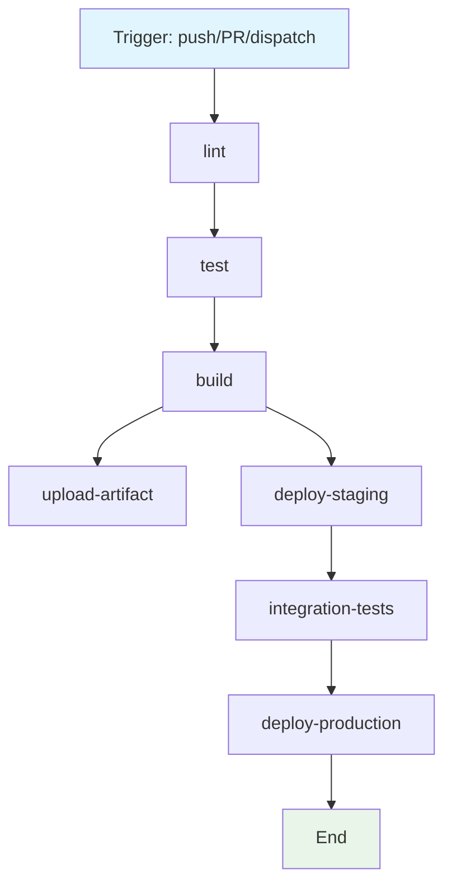

<!-- DRY-RUN ARTIFACT — generated by executing the prompt:
     prompts/create-github-action-workflow-specification.prompt.md
     Mode: dry-run (no GitHub Actions YAML was created; external write skipped).
     This document is the specification that WOULD be produced by the prompt. -->

# GitHub Actions Workflow Specification

> **DRY-RUN NOTICE**: This is a spec-only artifact. No `.github/workflows/*.yml`
> file was written. The workflow described below is a representative
> TypeScript/Node.js CI/CD pipeline produced by applying the prompt's
> analysis template to a canonical project shape.

## Workflow Overview

**Purpose**: Build, lint, test, and (on main) deploy a TypeScript/Node.js application via a gated CI/CD pipeline.
**Trigger Events**: `push` (branches: `main`, `release/*`), `pull_request` (target `main`), `workflow_dispatch`.
**Target Environments**: CI runner (build/test) → staging (on tag) → production (on manual approval).

## Execution Flow Diagram



## Jobs & Dependencies

| Job Name        | Purpose                                  | Dependencies        | Execution Context                  |
| --------------- | ---------------------------------------- | ------------------- | ---------------------------------- |
| lint            | Static analysis, formatting, type check  | —                   | ubuntu-latest, Node 20             |
| test            | Unit + coverage                          | lint                | ubuntu-latest, Node 20, matrix 18/20/22 |
| build           | Compile, bundle, produce artifact        | test                | ubuntu-latest, Node 20             |
| upload-artifact | Persist build output                     | build               | ubuntu-latest                      |
| deploy-staging  | Deploy to staging env                    | build               | ubuntu-latest, OIDC to cloud       |
| integration-tests | E2E against staging                    | deploy-staging      | ubuntu-latest                      |
| deploy-production | Gated production deploy                | integration-tests   | ubuntu-latest, OIDC, manual approval |

## Requirements Matrix

### Functional Requirements
- FR-1: Lint must pass before tests run.
- FR-2: Tests run across Node 18/20/22 matrix.
- FR-3: Build artifact uploaded and reusable by deploy jobs.
- FR-4: Staging deploys automatically on `main` push; production requires manual approval.

### Security Requirements
- SR-1: All third-party actions pinned to a full SHA.
- SR-2: Least-privilege `permissions:` declared per job.
- SR-3: Cloud auth via OIDC, no long-lived keys.
- SR-4: Secrets injected only into jobs that need them.

> **Full content:** `templates/create-github-action-workflow-specification/requirements_matrix.md`

## Input/Output Contracts

### Inputs

```yaml
# Environment Variables
NODE_VERSION: string   # Purpose: Node version selector (default "20")
REGISTRY: string       # Purpose: container/image registry host
DEPLOY_ENV: string     # Purpose: target environment label

# Repository Triggers
paths:
  - "src/**"
  - "package.json"
  - ".github/workflows/ci.yml"
branches:
  - "main"
  - "release/*"
```

### Outputs

```yaml
# Job Outputs
build_artifact: file   # Description: compiled dist (uploaded as artifact)
coverage_report: file  # Description: lcov/coverage summary
deploy_url: string     # Description: URL of staged deployment
```

## Secrets & Variables

| Type     | Name            | Purpose                         | Scope      |
| -------- | --------------- | ------------------------------- | ---------- |
| Secret   | CLOUD_OIDC_ROLE | Federated cloud deploy role ARN | Repository |
| Variable | REGISTRY_HOST   | Image registry hostname         | Repository |
| Variable | STAGING_URL     | Staging base URL                | Environment|

## Execution Constraints

### Runtime Constraints
- **Timeout**: 30 min per job (`jobs.<id>.timeout-minutes: 30`).
- **Concurrency**: `group: ci-${{ github.ref }}`, `cancel-in-progress: true`.
- **Resource Limits**: Standard GitHub-hosted runner (2 vCPU / 7 GB).

### Environmental Constraints
- **Runner Requirements**: `ubuntu-latest`.
- **Network Access**: npm registry, container registry, cloud API (OIDC).
- **Permissions**: `contents: read`; `id-token: write` (OIDC); `packages: write`.

## Error Handling Strategy

| Error Type         | Response            | Recovery Action                                  |
| ------------------ | ------------------- | ------------------------------------------------ |
| Build Failure      | Fail job, halt flow | Inspect logs; re-run on fix                      |
| Test Failure       | Fail job, upload cov| Triage coverage/lint report artifact             |
| Deployment Failure | Rollback staging    | Re-run `deploy-staging` from last good artifact  |

## Quality Gates

### Gate Definitions

| Gate          | Criteria                  | Bypass Conditions              |
| ------------- | ------------------------- | ------------------------------ |
| Code Quality  | ESLint clean, tsc no-error| None (blocking)                |
| Security Scan | 0 high/critical CVEs      | `main` hotfix w/ security lead |
| Test Coverage | >= 80% lines              | Feature flag behind `// TODO`  |

## Monitoring & Observability

### Key Metrics
- **Success Rate**: target >= 98%.
- **Execution Time**: target <= 8 min (test+lint+build).
- **Resource Usage**: runner CPU/mem via GitHub Metrics.

### Alerting

| Condition            | Severity | Notification Target     |
| -------------------- | -------- | ----------------------- |
| Prod deploy failed   | Critical | #release-alerts Slack   |
| Coverage < 80%       | Warning  | PR comment              |

## Integration Points

### External Systems

| System      | Integration Type | Data Exchange      | SLA Requirements     |
| ----------- | ---------------- | ------------------ | -------------------- |
| npm registry| Package fetch    | tarballs (HTTPS)   | best-effort          |
| Cloud (OIDC)| Federated deploy | tokens/artifacts   | 99.9% control plane  |

### Dependent Workflows

| Workflow          | Relationship      | Trigger Mechanism           |
| ----------------- | ---------------- | --------------------------- |
| release-tag.yml   | downstream        | `workflow_run` on success   |

## Compliance & Governance

### Audit Requirements
- **Execution Logs**: retained 90 days via GitHub.
- **Approval Gates**: production deploy requires `environment: production` reviewer.
- **Change Control**: spec edited first, then YAML (see Change Management).

### Security Controls
- **Access Control**: repo-admin manages secrets; devs open PRs.
- **Secret Management**: rotated quarterly; OIDC preferred.
- **Vulnerability Scanning**: `npm audit` + Trivy on each build.

## Edge Cases & Exceptions

### Scenario Matrix

| Scenario                | Expected Behavior              | Validation Method            |
| ----------------------- | ------------------------------ | ---------------------------- |
| PR from fork            | No secrets, no deploy          | Run with `secrets == null`   |
| Concurrent pushes       | Older run cancelled            | `concurrency.cancel-in-progress` |
| Path filter miss        | Workflow skipped               | push to `docs/` only         |

## Validation Criteria

### Workflow Validation
- **VLD-001**: YAML parses (`actionlint` clean).
- **VLD-002**: All actions pinned to SHA.
- **VLD-003**: Every job declares explicit `permissions:`.

### Performance Benchmarks
- **PERF-001**: cold-install + test <= 6 min.
- **PERF-002**: artifact upload <= 30 s.

## Change Management

### Update Process
1. **Specification Update**: Modify this document first.
2. **Review & Approval**: PR review by 1 maintainer.
3. **Implementation**: Apply changes to `.github/workflows/ci.yml`.
4. **Testing**: Validate via `workflow_dispatch` on a branch.
5. **Deployment**: Merge to `main`.

### Version History

| Version | Date       | Changes                    | Author        |
| ------- | ---------- | -------------------------- | ------------- |
| 1.0     | 2026-07-09 | Initial dry-run spec       | Hermes Agent  |

## Related Specifications
- Infrastructure spec: `docs/infra.md`
- Deployment spec: `docs/deploy.md`

---

### Dry-Run Execution Notes
- **Action**: Generated specification artifact (no GitHub Actions file written).
- **Output path**: `results/create-github-action-workflow-specification.output.md`
- **Skipped refs**: external write to `.github/workflows/` (dry-run); no live repo mutation.
- **Template source**: `prompts/create-github-action-workflow-specification.prompt.md`
